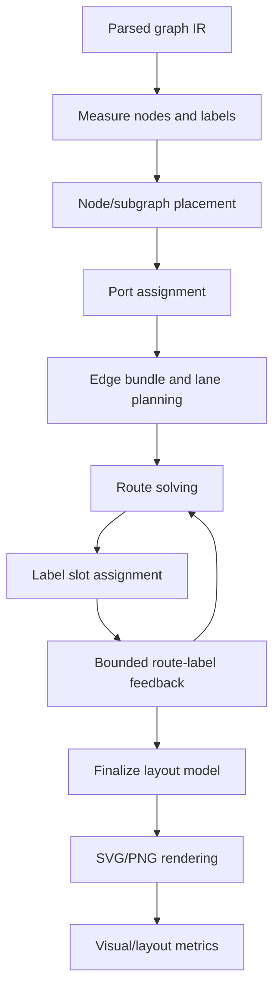

# Flowchart layout redesign plan

## Why we need a redesign

The current flowchart layout pipeline has accumulated several successful local fixes, but the fixes now interact in fragile ways. Recent examples:

- #63 label overlap was fixed by post-routing label deoverlap.
- Arrowheads were fixed in rendering by drawing flowchart arrowheads in the edge layer and orienting them from the attached node side.
- A quick second label-deoverlap pass fixed `flowchart_parallel_edges_bundle`, but worsened `flowchart_label_collision`.

That pattern means the architecture is missing a shared model of routes, labels, ports, lanes, and obstacles. Labels are sometimes constraints, sometimes obstacles, and sometimes post-hoc decorations. Edge routes are similarly adjusted by several passes without a single source of truth.

## Current failure modes

### 1. Labels are not first-class routing objects

Labels are measured early, assigned tentative anchors, routed around in some cases, then moved again after route cleanup. This creates feedback loops that are not represented in the model:

```text
route -> label anchor -> route cleanup -> label deoverlap -> label nudge
```

When a label is moved after routing, the route may no longer be the best route for that label. When a route is cleaned up after label reservation, the label may no longer match the route.

### 2. Parallel and bidirectional edges lack a bundle model

Parallel edges are currently handled through pair counts, offsets, port offsets, occupancy, and post-label deoverlap. These are useful mechanisms, but they are not grouped into a durable concept like:

```text
EdgeBundle { endpoints, members, lanes, shared corridor, label slots }
```

Because of that, the renderer sees individual polylines, not a bundle with coherent lane ordering.

### 3. Port assignment and route solving are too coupled

Port sides and offsets are selected before routing, but route cleanup can invalidate assumptions around endpoint approach direction. This caused the arrowhead visual issue: route endpoints could be correct geometrically, while arrowhead orientation/paint order was not semantically tied to the node side.

### 4. Subgraphs act as both containers and obstacles

Subgraphs participate in placement, obstacle generation, route cleanup, and final assertions. The model does not clearly distinguish:

- member containment bounds
- title/header area
- reserved edge corridors
- external boundary crossing ports

This is why some stress fixtures still panic around top-level subgraph overlap or corridor cleanup.

### 5. Validation is too scattered

We have many unit tests and fixture rendering tests, but layout quality needs recurring metrics:

- label-label overlap
- label-own-edge distance
- label-foreign-edge intersection
- route-node/subgraph intersections
- edge bend count
- edge length vs ideal Manhattan length
- endpoint approach consistency
- subgraph overlap/containment
- PNG snapshots for visual review

## Target architecture

The redesign should be staged, not a rewrite. The key is to introduce explicit intermediate data models and migrate one phase at a time.



### Phase A: Visual regression harness

Before changing core layout, add a stable harness that renders a curated set of hard cases and computes metrics.

The first implementation is `scripts/flowchart_redesign_gate.py`. It renders curated fixtures, dumps layout JSON, computes existing quality metrics, converts SVGs to PNG when `rsvg-convert` is available, and writes an HTML report. It can compare the current working tree against a git ref:

```bash
python3 scripts/flowchart_redesign_gate.py \
  --before-ref 87b45a4 \
  --out-dir tmp/flowchart-redesign-gate \
  --open
```

Initial gate fixtures:

- `tests/fixtures/flowchart/bidirectional_labels.mmd` (#63)
- `benches/fixtures/flowchart_parallel_edges_bundle.mmd`
- `benches/fixtures/flowchart_parallel_label_stack.mmd`
- `benches/fixtures/flowchart_selfloop_bidi.mmd`
- `benches/fixtures/flowchart_label_collision.mmd`
- `benches/fixtures/flowchart_ports_heavy.mmd`
- `benches/fixtures/flowchart_medium.mmd`
- selected subgraph stress cases that currently render without panic

Metrics should be emitted as JSON and displayed in an HTML report with before/after PNGs.

### Phase B: Layout model structs

Add explicit internal structs under `src/layout/flowchart/` without changing behavior initially:

```rust
struct FlowchartLayoutPlan {
    nodes: BTreeMap<String, NodeLayout>,
    subgraphs: Vec<SubgraphLayout>,
    ports: Vec<EdgePortPlan>,
    bundles: Vec<EdgeBundlePlan>,
    routes: Vec<EdgeRoutePlan>,
    labels: Vec<EdgeLabelPlan>,
    obstacles: ObstacleSet,
}

struct EdgePortPlan {
    edge_idx: usize,
    start_side: EdgeSide,
    end_side: EdgeSide,
    start_offset: f32,
    end_offset: f32,
    start_point: (f32, f32),
    end_point: (f32, f32),
}

struct EdgeBundlePlan {
    key: BundleKey,
    edge_indices: Vec<usize>,
    lanes: Vec<EdgeLanePlan>,
    corridor: Option<Corridor>,
}

struct EdgeLanePlan {
    edge_idx: usize,
    lane_index: i32,
    lane_offset: f32,
    label_slot_hint: LabelSlotHint,
}

struct EdgeRoutePlan {
    edge_idx: usize,
    points: Vec<(f32, f32)>,
    approach_start: EdgeSide,
    approach_end: EdgeSide,
    quality: RouteQuality,
}

struct EdgeLabelPlan {
    edge_idx: usize,
    label: TextBlock,
    anchor: Option<(f32, f32)>,
    slot: Option<LabelSlot>,
    role: LabelRole,
}
```

The first pass can populate these from existing data and assert equivalence with current `EdgeLayout` output.

### Phase C: Bundle/lane planning before route solving

Replace ad hoc pair offsets with a planned bundle stage:

1. Group edges by unordered endpoint pair for parallel/bidirectional bundles.
2. Choose stable lane ordering based on edge direction, style, and label width.
3. Assign symmetric lane offsets.
4. Allocate label slots along lanes before solving paths.
5. Pass lane/corridor constraints into the router.

This should fix cases like `API Gateway -> Command Bus` more robustly than a post-hoc label shuffle.

### Phase D: Label placement becomes route-aware, not post-hoc

Labels should have candidate slots generated from route segments and bundle lanes. The route solver should receive label slot obstacles, then label assignment should choose among route-compatible slots.

The feedback loop should be bounded:

```text
route with provisional label slots
-> assign labels
-> if metrics worsen, retry with alternate lanes/slots
-> final route/label commit
```

No unbounded or late global nudge should be able to worsen unrelated diagrams.

### Phase E: Subgraph corridor model

Subgraphs need explicit geometry roles:

- member bounds
- title/header bounds
- internal padding
- external crossing ports
- reserved corridors

This should replace brittle post-cleanup assertions where possible.

## Acceptance gates

Every phase should pass:

```bash
cargo fmt -- --check
cargo clippy -- -D warnings
cargo test
cargo check --no-default-features
```

And the visual harness should show:

- #63 stays at zero center-label overlap.
- No increase in label-overlap total/max/count on the curated fixture set unless explicitly accepted.
- No new node/subgraph intersection failures.
- Arrowheads remain visually outside node interiors.
- PNG before/after report is reviewed for aesthetics.

## First implementation step

Start with Phase A and B:

1. Add a reusable visual metrics/report script or test helper.
2. Add the `FlowchartLayoutPlan` data model behind existing behavior.
3. Populate it from the current pipeline without changing output.
4. Add assertions/snapshots so future bundle/label changes are measurable.

This creates a safe migration path for the actual bundle and label-placement redesign.
